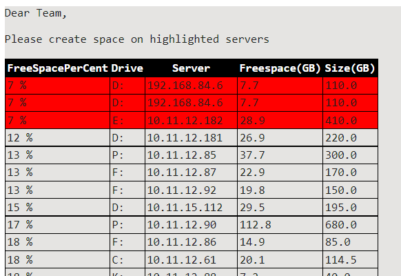

# Powershell-Scripts

•	**DiskSpaceReport.ps1**  –  Creates html report for drive capacity on windows servers and sends this report through email to IT admins. Additionally it saves report in a separate excel file. It highlights drives which have free space lower than 10 %.  This script can be scheduled to run once a day.   Prerequisites:
 3 text files are required - 1. Server IP List file   &nbsp;&nbsp;2. File that stores encryption key    &nbsp;&nbsp;3. File that stores encrypted admin password.   Account with domain admin & exchage admin privileges
  Report will be created as shown below - 
 

•	**OutlookProfile.ps1**  - Creates new outlook profile. New profile name is "NewOutlookProfile". It first deletes existing registry keys & ost file for newoutlookprofile. Then it registers new profile name in windows registry & sets it as default profile. After running this script, outlook will connect with new local outlook profile.   This script can be pushed from SCCM to software center on client computers. This way, user can create profile by himself without contacting IT team. 
